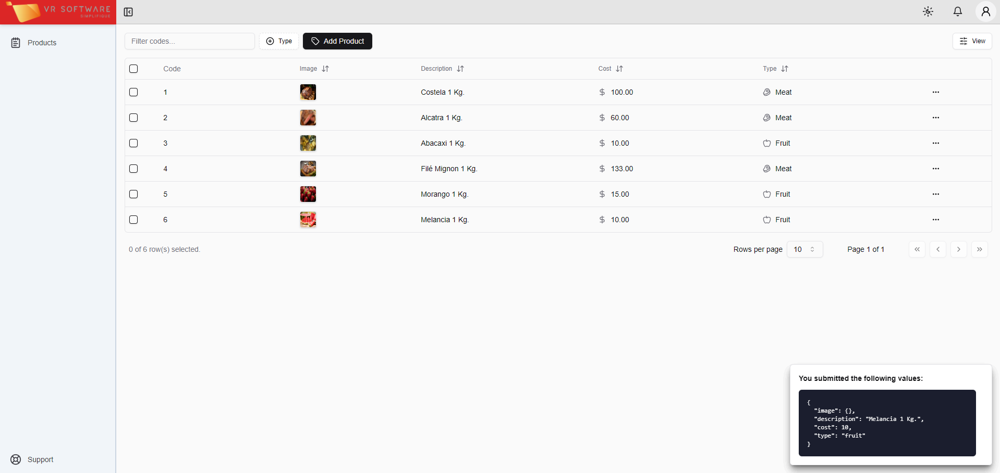

# VR_SOFTWARE



## Start the python_backend:
```bash
poetry shell
poetry install
poetry run flask run

# or

python3 -m venv venv
source venv/bin/activate
pip install -r requirements.txt
export FLASK_ENV=development
flask run
```

<a href="http://127.0.0.1:5000/get_products" target="_blank">Access</a>.

## Start the vuejs_frontend (with connection to APIs):
```bash
pnpm install
pnpm run dev
```

### Run the tests:

With the backend and frontend in vue.js running, run the following command:

```bash
pytest run tests/unit/test_unit.py
pytest run tests/integration/test_integration.py
```

## flutter_frontend:

Status = incomplete.